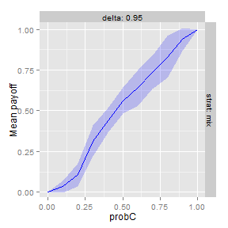
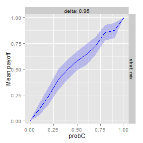
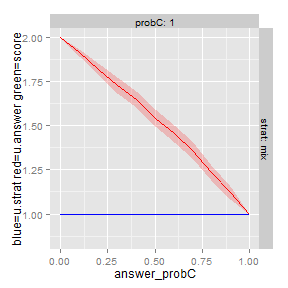
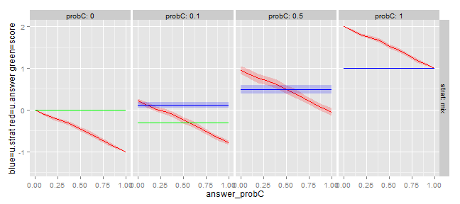
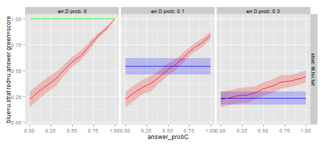

Analyzing Cooperation with Game Theory and Simulation
========================================================================
Tutorial for the R package StratTourn
========================================================================

**Date: 2013-10-21**

**Author: Sebastian Kranz (sebastian.kranz@uni-ulm.de)**

**with help by Martin Kies (martin.kies@uni-ulm.de)**

## 1. Installing neccessary software

### 1.1 Installing R and RStudio

First you need to install R, which is a very popular and powerful open source statistical programming language. You can download R for Windows, Max or Linux here:
  
  http://cran.r-project.org/

Note: If you have already installed R, you may want to update to the newest version by installing it again. 

I recommend to additionally install RStudio, which is a great open source IDE for R:

http://rstudio.org/

### 1.2 Installing necessary R packages

You need to install several R packages from the internet. To do so, simply run in the R console the following code (you can use copy & paste):

```r
install.packages("devtools")
install.packages("data.table")
install.packages("ggplot2")
install.packages("reshape2")
install.packages("lattice")

library(devtools)
install_github(repo = "restorepoint", username = "skranz")
install_github(repo = "sktools", username = "skranz")
install_github(repo = "StratTourn", username = "skranz")
```


## 2. Brief Background: The Prisoners' Dilemma Game

In the 'Evolution of Cooperation' Robert Axelrod describes his famous computer tournament that he used to investigate effective cooperation strategies in repeated social dilemma situations. His tournament was based on a repeated *prisoner's dilemma game*, which I will also use as an example in this tutorial.

### 2.1 The one-shot Prisoner's Dilemma
A one-shot prisoner's dilemma (short: PD) is played only once. We can describe a PD by the following *payoff matrix*:

<center><table border="1"><tr>
    <td align='center'>Pl 1. / Pl. 2</td>
    <th align='center'>C</th>
    <th align='center'>D</th>
  </tr><tr>
    <th align='center'>C</th>
    <td align='center'>  1, 1</td>
    <td align='center'> -1, 2</td>
  </tr><tr>
    <th align='center'>D</th>
    <td align='center'>  2,-1</td>
    <td align='center'>  0, 0</td>
</tr></table></center>

Each player can either cooperate *C* or defect *D*, which means not to cooperate. The row shows player 1's action and the column player 2's. The cells show the *payoffs* of player 1 and 2 for each *action profile*. For example, when player 1 cooperates C and player 2 defects D, i.e. the action profile (C,D) is played, then player 1's payoff is -1 and player 2's payoff is 2.

The highest average payoff (1,1) could be achieved if both players cooperate (C,C). Yet, assume that both players decide independently which action they choose, i.e. player 1's action does not influence player 2's action and vice versa. Then no matter which action the other player chooses, a player always maximizes its own payoff by choosing D. In game theoretic terms, choosing D is *strictly dominant* in a PD game that is played only once. (Consequently, the only *Nash equilibrium* of the one-shot PD is (D,D)). 

### 2.2 The repeated Prisoner's Dilemma

In this seminar, we will mostly consider games that are repeated for an uncertain number of periods. Let $\delta \in [0,1)$ be a continuation probability (we will also often refer to $\delta$ as *discount factor*). After each period a random number is drawn and the repeated game ends with probability $1-\delta$, i.e. it continues with probability $\delta$. In the basic version (formally called a PD game with *perfect monitoring*) all players exactly observe the actions that the other players have played in the previous periods. It is then no longer strictly dominant to always play D. For example, player 2's action in period 2 may depend on what player 1 did in period 1: she may only play C if player 1 has played C in period 1 and otherwise play D. A player's optimal strategy now depends on how the other player reacts to her action and cooperation may become rational even for pure egoists.

It turns out that if the continuation probability $\delta$ is large enough, such repeated games often have a very large number of *Nash equilibria*. This means we can have many possible profiles of strategies that are stable in the sense that it is optimal for each player to follow her strategy given the strategies of the other players. In some Nash equilibria players will cooperate a lot, in others very little or not at all.

### 2.3 What will we do in the seminar?

We search for stable, socially efficient cooperative strategy profiles in several strategic interactions and study which factors make cooperation harder and how one best adapts cooperation strategies to such factors. I will typically interpret such strategy profiles as stable *social norms* that allow a high degree of cooperation in a society.

We do this search by programming strategies in R and let them play against each other in a tournament (more on that below). During the seminar, we will discuss a bit informally in how far the winning strategies of our tournament are related to game theoretic equilibrium concepts, like the *Nash equilibrium*. For those who already know more about Nash equilibria, let us just state that the socially most efficient Nash equilibria probably would have a very good chance to be winners in our tournaments, but often it is very hard to find these equilibria.

## 3. Getting Started: Developing strategies for the repeated Prisoner's Dilemma in R

Preparations:
 1. Make sure you installed all software and packages as described in Section 1
 2. Download the file *pdgame.r*, save it in some working directory, and open it with RStudio. 
 3. Press the "Source" button above on the right of the editor window to load all functions of this file.
 4. Consider the code inside the function examples.pd, select the following lines and press the "Run" button (or press Ctrl-Enter):


```r
# Load package
library(StratTourn)

# Generate a PD game object
game = make.pd.game()
# Pick a pair of strategies (strategies are defined below)
strat = nlist(tit.for.tat, random.action)

# Let the strategies play against each other one repeated PD
run.rep.game(delta = 0.9, game = game, strat = strat)
```

```
## $hist
##   t obs_a1 obs_a2 a1 a2 pi1 pi2
## 1 1   <NA>   <NA>  C  D  -1   2
## 2 2      C      D  D  D   0   0
## 3 3      D      D  D  C   2  -1
## 4 4      D      C  C  C   1   1
## 
## $u
## [1] 0.5 0.5
```

This code simulates a repated PD with continuation probability $\delta=0.9$ in which player 1 follows a strategy called "tit.for.tat" and player 2 follows a strategy called "random.action". The resulting table shows for each period the following information:

  * Columns obs_a1 and obs_a2: the observations at the beginning of a period. Here just the previous actions
  * Columns a1 and a2: players' actions 
  * Columns pi1 and pi2: the resulting payoffs in that period.
  
Below the table, the entry $u shows players' average payoffs across all periods.

### 3.1 Tit-for-Tat

Tit-for-Tat was the winning strategy in Axelrod's original tournament. It has a simple structure:

  * Start nice by cooperating in period 1
  * In later periods play that action that the other player has played in the previous period. 

### 3.2 Tit-for-Tat as a R function

Further below in the file pdgame.r you find a definition of tit.for.tat as a R function:

```r
tit.for.tat = function(obs, i, t, game) {
    debug.store("tit.for.tat", i, t)  # Store each call for each player
    debug.restore("tit.for.tat", i = 1, t = 2)  # Restore call for player i in period t
    
    # Cooperate in the first period
    if (t == 1) 
        return(list(a = "C"))
    
    # In later periods, return the other player's previous action
    j = 3 - i
    list(a = obs$a[j])
}

```


The first line

```r
tit.for.tat = function(obs,i,t,game) {
```

says that tit.for.tat is a function with the following arguments:

  * i: this is simply the number of the player, either 1 or 2
  * t: this is the number of the current period
  * obs: this is a [list](http://cran.r-project.org/doc/manuals/R-intro.html#Lists) that contains a player's observations about behavior from the previous period. The exact structure of observations will depend on the specification of the game that is played. In our basic PD game obs contains an element obs$a that is a vector with the two actions that the players have chosen in the previous period.
  * game: this is an object that describes the structure of the game that is currently played. In game$param different parameters of the game, like the stage game payoffs, are stored. You only need to use this variable, if you want to write general strategies that can be used for more than one game and that are fine tuned for different games. In the moment you just can ignore this variable.

Every strategy must have these 4 arguments. (There may be additional aguments if a strategy uses states to pass additional information between periods. This is explained further below). The function run.rep.game now calls this function tit.for.tat in every period and provides the corresponding values of i,t,obs and game. E.g. if it is called in the third period for player 1 and in the previous round (D,C) was played, we have i==1, t==3, obs$a[1]=="D" and obs$a[2]=="C". Based on the values of obs, t, i the function must return the action that the player chooses.

The lines 

```r
debug.store("tit.for.tat", i, t)  # Store each call for each player
debug.restore("tit.for.tat", i = 1, t = 2)  # Restore call for player i in period t
```

are useful for debugging a strategy and can be ignored for the moment (you can also remove them without changing the behavior of the strategy).

The lines

```r
if (t == 1) return(list(a = "C"))
```

state that in the first period, i.e. t==1, the player cooperates. That the player cooperates means that the function returns a list


```r
list(a = "C")
```


where the element a is "C". In more complex games, a function may return more than a single action. The exact structure of the list of actions that a function has to return will be explained in the corresponding exercises. Note that we ommitted the "{" brackets of the 'if' condition. We can do that iff there follows exactly one statement after the condition.

The lines

```r
j = 3 - i
list(a = obs$a[j])
```

describe the behavior in periods t>1. The variable j will be the index of the other player (if i=1 then j=2 and if i=2 then j=1). The last line says that the player choses that action that the other player has played in the previous period, i.e. obs$a[j]. (Note that in the last line of a function you can ommit writing "return".)


### 3.3 Strategies that use states. Example: strange.defector

Many strategies rely not only on the most recent observations which are saved in obs. Consider for example this self-developed (not very clever) strategy:

 * "Strange Defector":  In the first round cooperates with 70% probability, otherwise defects. As long as the player cooperates, he continues in this random fashion. Once the player defects, he plays 4 additional times "defect" in a row. Afterwards, he plays again as in the first period (randomizing, and after defection, 4 defects in a row).
 
Here is an R implementation of this strategy:


```r
strange.defector <- function(obs, i, t, game, still.defect = 0) {
    debug.store("strange.defector", i, t)  # Store each call for each player
    debug.restore("strange.defector", i = 1, t = 2)  # Restore call for player i in period t
    
    # Randomize between C and D
    if (still.defect == 0) {
        do.cooperate = (runif(1) < 0.7)
        # With 60% probability choose C
        if (do.cooperate) {
            return(list(a = "C", still.defect = 0))
        } else {
            return(list(a = "D", still.defect = 4))
        }
    }
    
    # still.defect is bigger 0: play D and reduce still.defect by 1
    still.defect = still.defect - 1
    return(list(a = "D", still.defect = still.defect))
}
```

Compared to the tit.for.tat function, the strange.defector function has an additional argument, namely *still.defect* which in the first round t=1 has the value 0.
Also the returned lists contain an additional field named *still.defect*.  The variable *still.defect* is a  manually generated *state variable*.


#### How state variables transfer information between periods:
```
The value of a state variable that is passed to your function in period t is the value of the state that your function has returned in period t-1. (The value of a state in period 1 is the value you specify in the function definition).
```
#### Name and number of state variables
```
You can freely pick the name of a state variable (except for the reserved names ops,i,t, game and a) and you can have more than one state variable.
```
#### Which values can state variables take?
```
States can take all sort of values: numbers (e.g 4.5), logical values (TRUE or FALSE), strings (e.g. "angry"), or even vectors. You just should not store a list in a state variable.
```

#### Back to the example:
In our example, the state variable *still.defect* captures the information how many rounds the streak of defection should still last.

Let us have a more detailed look at the code of the example. The line

```r
  strange.defector <- function(obs, i, t, game, still.defect=0){
```

initializes the function with a state still.defect that has in the first period a value of 0. 
The lines

```r
if (still.defect == 0) {
    do.cooperate = runif(1) < 0.7
    # With 60% probability choose C
    if (do.cooperate) {
        return(list(a = "C", still.defect = 0))
    } else {
        return(list(a = "D", still.defect = 4))
    }
}

```

first check whether we are in the initial state (still.defect=0), in which we randomize between C and D. If this is the case, we draw with the command

```r
do.cooperate = (runif(1) < 0.7)
```

a logical random variable that is TRUE with 70% probability and otherwise FALSE. (To see this, note that runif(1) draws one uniformely distributed random variable between 0 and 1). The lines

```r
    if (do.cooperate){
      return(list(a="C", still.defect=0))
```

state that if the random variable says that we should cooperate, we return the action "C" and keep the state still.defect=0. The lines 

```r
    } else {
      return(list(a="D", still.defect=4))
    }
```

state that otherwise, we return the action "D" and set the state still.defect = 4. This means that we will defect for the next 4 periods. In the next period the value of still.defect will be 4 and the code at the bottom of the function will be called:

```r
still.defect = still.defect - 1
return(list(a = "D", still.defect = still.defect))
```

The first line reduces still.defect by 1. (Hence, after 4 periods, we will again be in the state still.defect =0 and choose a random action). The second line returns our action a="D" and the new value of our state still.defect.


If you run a single repeated game the result table also shows in each row, the values of the strategies' states at the *end* of the period:

```r
run.rep.game(delta = 0.9, game = game, strat = nlist(strange.defector, tit.for.tat), 
    T.min = 20)
```

```
## $hist
##     t obs_a1 obs_a2 a1 a2 pi1 pi2 still.defect_1
## 1   1   <NA>   <NA>  D  C   2  -1              4
## 2   2      D      C  D  D   0   0              3
## 3   3      D      D  D  D   0   0              2
## 4   4      D      D  D  D   0   0              1
## 5   5      D      D  D  D   0   0              0
## 6   6      D      D  D  D   0   0              4
## 7   7      D      D  D  D   0   0              3
## 8   8      D      D  D  D   0   0              2
## 9   9      D      D  D  D   0   0              1
## 10 10      D      D  D  D   0   0              0
## 11 11      D      D  C  D  -1   2              0
## 12 12      C      D  C  C   1   1              0
## 13 13      C      C  C  C   1   1              0
## 14 14      C      C  C  C   1   1              0
## 15 15      C      C  C  C   1   1              0
## 16 16      C      C  C  C   1   1              0
## 17 17      C      C  C  C   1   1              0
## 18 18      C      C  C  C   1   1              0
## 19 19      C      C  C  C   1   1              0
## 20 20      C      C  D  C   2  -1              4
## 21 21      D      C  D  D   0   0              3
## 22 22      D      D  D  D   0   0              2
## 
## $u
## [1] 0.4096 0.1490
```


### 3.4 Exercise:

Implement the following strategy in R.

  - tit3tat: The player starts with C and plays like tit-for-tat in period t=2 and t=3. In period t>3 the player plays with 60% probability like tit-for-tat and with 30% probability he plays the action that the other player played in the pre-previous period, i.e. in t-2 and with 10% probability he plays the action the other player played in t-3.
  
  Hints:
  1. To do something with 60% probability, you can draw a random variable x with the command x=runif(1) that is uniformely distributed between 0 and 1 and then check whether x<=0.6. To do something else with 30 probability, you can check 0.6 < x & x <= 0.9 and so on...
  2. To save a longer history you can either use a function that has more than one state or store a vector in a state variable.

## 4. Running a tournament between strategies

The following lines run a tournament between 4 specified strategies


```r
# Init and run a tournament of several strategies against each other
game = make.pd.game()
strat = nlist(strange.defector, tit.for.tat, always.defect, always.coop)
tourn = init.tournament(game = game, strat = strat, delta = 0.95, score.fun = "efficiency-2*instability- 20*instability^2")
tourn = run.tournament(tourn = tourn, R = 10)
tourn
```

```
## 
## Tournament for Noisy PD (10 rep.)
## 
##                  strange.defector tit.for.tat always.defect always.coop
## strange.defector            0.296       0.396       -0.3100        1.68
## tit.for.tat                 0.291       1.000       -0.0501        1.00
## always.defect               0.583       0.100        0.0000        2.00
## always.coop                -0.338       1.000       -1.0000        1.00
## 
## Ranking with score = efficiency-2*instability- 20*instability^2
## 
##                  rank   score efficiency instability u.average   best.answer
## tit.for.tat         1   1.000      1.000       0.000     0.560   tit.for.tat
## always.defect       2   0.000      0.000       0.000     0.671 always.defect
## strange.defector    3  -1.917      0.296       0.286     0.515 always.defect
## always.coop         4 -21.000      1.000       1.000     0.166 always.defect
```


The tournament consists of R rounds (here R=15). In every round, every strategy plays against each other strategy in a repeated game. Every strategy also plays against itself. For every pairing of two strategies, we then compute the average payoff of the strategies over all R rounds

The first matrix has for every strategy a row and column and shows the average payoff of the *row strategy*  when the row strategy plays against the column strategy. (In a symmetric game like the PD game, we will just display the average payoffs of both player 1 and player 2). For example, when strategy always.defect played against always.coop, then always.defect got on average a payoff of  2 and always.coop got on average a payoff of -1. Against itself always.coop got an average payoff of 1.

The table below shows which strategies have won, as well as their score, efficiency, instability and best answer.

### 4.1 Social norms, efficiency, instability and score

How do we determine the winner of the tournament? Axelrod ranked the strategies according to their average payoff across all pairings. This average payoff is shown in the column *u.average*. We will use different scores to rank strategies, however. 

Our underlying question is the following. Assume interactions in a group are such that people, who essentially want to maximize their own payoffs, are randomly matched with each other and play the specified repeated game. What would be a **"good social norm"** that one could teach to all people and which describes how they should behave in their interactions? More compactly:

** We search for strategies that would be efficient and stable social norms if everybody would follow these strategies**

What do we mean with efficient and stable?

#### **Efficiency:**

We define efficiency of a strategy is the **average payoff** the strategy achieves when it plays **against itself**. Hence, the efficiency is the average payoff of every person in the group if *everybody* in the group would follow this strategy.

#### **Best answer:**

The best answer against a strategy s shall be that strategy (from all strategies that participate in the tournament) that has the highest payoff against s. The column *best.answer* shows the best answer for each strategy. Note that several strategies can be best answers if they achieve the same payoff (we then only show one). Also note that a strategy can be a best answer against itself.

#### **Instability:**

We define the instability of a strategy s as the following difference:

    instability = best answer payoff against s - payoff of s against itself

Note that a strategy that is a best answer against itself has an instability of 0 and is therefore very stable. The following idea lies behind this definition of instability. We assume that persons want to maximize their own payoff. If s has a high instability value, it has the following problem: if everybody follows s, people have very high incentives not to follow s (deviate from s) and play the best answer strategy instead. The strategy s would not be a robust, sustainable social norm.


#### Relationship to Best Replies and Nash equilibrium
The idea that strategies should be stable is closely related to the game theoretic concept of a **Nash equilibrium**. Similar to our concept of a best answer, game theory knows the related concept of a *best reply*:

  - In a two player game, player i's  **best reply** to a strategy s of player j is that strategy that maximizes i's expected payoff across **all possible strategies**

  - If every player follows a strategy s, we have a **Nash equilibrium** if and only if **s is a best reply against itself** 

Hence a strategy that forms a **Nash equilibrium** would have instability of 0 (abstracting from small sample problems), yet instability of 0 does not imply that the strategy will form a Nash equilibrium. That is because we have the following main difference between best-replies and best answers:

  - **Main difference best answer vs best reply**: Best answers only consider those strategies that participate in the tournament, while a best reply considers *all* possible strategies (there are typically infinitely many strategies).

There are also additional differences. If you are not firm in game theory, you just can ignore them. If you are firm you just should notice these points but hopefully not bother too much.

  - To compute best answers, we just take average payoffs from small sample of played repeated games, best replies are based on true expected payoffs.

  - Compared to game theoretic terminology, our use of the term strategy is quite imprecise with respect to which players plays the strategy (Our R functions are defined for both players and could in game theoretic terms also be seen as *strategy profiles*). When computing best answers we don't distinguish between player 1's best answer against player 2 and vice versa, but we will just take the mean of player 1's and player 2's payoffs. 

#### Score

The score of a strategy is a formula that combines its effieciency and instability. The basic rule is

```
The score increases in the efficiency and decreases in the instability
```

In the example we use the following formula:
\[
    score = efficiency - 2 * instability - 20*instability^2
\]

The quadratic term makes sure that large instability gets more strongly penalized than small instability. It is not clear how much we want to penalize instability. Game theory always puts a lot of emphasis on stability, since a Nash equilibrium needs an instability of 0. On the other hand, checking instability is not so easy and it can be very hard in the tasks of our seminar to find somewhat efficient strategies that really have an instability of 0. A score that allows some degree of instability may be a sensible criterion if we think about norms in a society in which at least some people have some intrinsic motivation to follow a prevailing norm or simply are too lazy to think much about a profitable deviation from the prevailing norm. 

In our example, always.defect is the winner of the tournament. It is able to sustain cooperation in every period and has instability 0 (one can indeed show that it is a Nash equilibrium of that repeated PD). While always.coop also has a high efficiency, it looses because it is very instable. That is because a player who plays always.defect against always.coop makes a much higher payoff than a player who plays always.coop against always.coop.


#### Second stage of tournament: Finding better answers to destabilize competing strategies

To somewhat mitigate an issue related to the main difference between best answers and best replies, we will play two rounds of the tournament in our seminar. After the first round, the teams get the source code of all other strategies and have some time to develop new strategies that are just designed to become best answers against the strategies of the other teams. More precisely, the goal of a team's second stage strategies is just to increase the computed instability of other teams' first stage strategies and thereby decrease their score. This will be explained in more detail in the seminar.


## 5. Guidelines for your Strategies

### Keep it sufficiently simple, intuitive, clean and fast

Your strategies and the implementation as R should be intuitively understandable. It is not the goal to develop extremely complex strategies with a large number of states that nobody understands and that require extremely complicated computations. The idea is that strategies resemble some sort of social norms. Also take into account that for the simulations we may run your strategy on the order of a million times, so don't make any complicated computations that need very long to run. That being said your strategy does not have to be as simple as tit-for-tat.

### Don't cheat

If you are a hacker, you may think of many ways to cheat. For example, it might be really useful to find out whether your strategy plays against itself, but the rules of the basic PD game don't give you an effective way to communicate (you can only choose C or D). So you may think of exchanging information by writing information into a global R variable which the other player can read out. Such things are considered cheating and **not allowed**.

  * You are only allowed to use the information that is passed to the function as parameters (including the states you returned in earlier periods).
  * You are not allowed to modify any external objects.
  
As a rule of thumb: if you wonder whether something is cheating it probably is; if you are not sure ask us.

## 6. Debugging a strategy

When you first write a strategy or other R function, it often does not work correctly: your function is likely to have bugs. Some bugs make your programm stop and throw an error message, other bugs are more subtle and make your function run in a different fashion than you expected. *Debugging* means to find and correct bugs in your code. There are different tools that help debugging. I want to illustrate some debugging steps with an example.

Consider the following strategy, which I call "exploiter":

  * Exploiter: In the first period cooperate. If the other player cooperates for two or more times in a row defect. Otherwise play with 70% probability tit-for-tat and with 30% probability play defect. 

Here is a first attempt to implement this strategy as an r function (it contains a lot of bugs):

```r
exploiter = function(obs,i,t,game, otherC) {
  debug.store("exploiter",i,t) # Store each call for each player
  debug.restore("exploiter",i=1,t=2) # Restore call for player i in period t

  # Start nice in first period
  if (t=1) {
    return(list(a="C",otherC=0))
  }
  # If the other player has chosen C two or more times in a row play D
  if (obs$a[[j]]=="C") otherC= otherC + 1
  
  if (otherC > 2) return(list(a="D"))
  
  # Play tit for tat with probability 70% and with prob. 30% play D
  if (runif(1)<70) {
    a = obs$a[[j]]
  } else {
    a = "D"
  }
  return(nlist(a=a,otherC))
}

```


### Step 1: Run function definition in R console and correct errors

As a first step select the whole function in the RStudio editor and press the run button. You should see something similar to the following in the R console.
```
> exploiter = function(obs,i,t,game, other.weakness) {
+  debug.store("exploiter",i,t) # Store each call for each player
+  debug.restore("exploiter",i=1,t=2) # Restore call for player i in period t
+  if (t=1) {
Error: unexpected '=' in:
"exploiter = function(obs,i,t,game, other.weakness) {
  if (t="
>     return(list(a="C",other.weakness=0))
Error: no function to return from, jumping to top level
>   }
Error: unexpected '}' in "  }"
>   if (obs$a[[j]]=="C") {
+     other.weakness = other.weakness + 1
+   }
Error: object 'j' not found
>   if (other.weakness > 2) {
+     return(list(a="D"))
+   }
Error: object 'other.weakness' not found
>   # Follow tit for tat with probability 70% otherwise play D
>   a = ifelse(runif(1)<0.7,obs$a[[j]],"D")
Error in ifelse(runif(1) < 0.7, obs$a[[j]], "D") : object 'j' not found
>   return(nlist(a=a,other.weakness))
Error in nlist(a = a, other.weakness) : object 'other.weakness' not found
> }
Error: unexpected '}' in "}"
```

There are a lot of error messages. It is best to start with the first error message and try to correct the corresponding code.

```
  if (t=1) {
  Error: unexpected '=' in:
  "exploiter = function(obs,i,t,game, other.weakness) {if (t="
```

This is a typical beginner error. If we want to check whether t is 1, we need to write t==1 instead of t=1. (The expression t=1 means that the value 1 is assigned to the variable t, expression t==1 is a boolean expression that is TRUE if t is 1 and FALSE otherwise.)  A corrected version of the function is

```r
exploiter = function(obs, i, t, game, otherC) {
    debug.store("exploiter", i, t)  # Store each call for each player
    debug.restore("exploiter", i = 1, t = 2)  # Restore call for player i in period t
    
    # Start nice in first period
    if (t == 1) {
        return(list(a = "C", otherC = 0))
    }
    # If the other player has chosen C two or more times in a row play D
    if (obs$a[[j]] == "C") 
        otherC = otherC + 1
    
    if (otherC > 2) 
        return(list(a = "D"))
    
    # Play tit for tat with probability 70% and with prob. 30% play D
    if (runif(1) < 70) {
        a = obs$a[[j]]
    } else {
        a = "D"
    }
    return(nlist(a = a, otherC))
}
```


If you run this new version in the console, no error is shown. Unfortunately, this does not mean that there

### Step 2: Check whether run.rep.game yields errors and debug such errors by stepping trough function

As next step let us run run.rep.game with the strategy and check whether some errors are shown.

```r
run.rep.game(delta = 0.95, game = game, strat = nlist(exploiter, random.action))
```

```
## Error in evaluating strategy exploiter in period t=2 for player i=1
## ERROR.HIST:
```

```
##    t obs_a1 obs_a2   a1   a2 pi1 pi2 otherC_1
## 1  1     NA     NA    C    D  -1   2        0
## 2 NA     NA     NA <NA> <NA>  NA  NA       NA
```

```
## Error: Error in (function (obs, i, t, game, otherC) : object 'j' not found
```

We get an error message and learn that an error occurred when calling exploiter for player i=1 in period t=2. We also get the error message "object 'j' not found". Probably you see the problem directly from that message. Nevertheless, let us pretend we have not found the problem yet and let us step through our function.
Go to the function code and run the line

```r
debug.restore("exploiter", i = 1, t = 2)  # Restore call for player i in period t
```

```
## Restored:  game,i,obs,otherC,t
```

in the R console by selecting the line and pressing the "Run" button or Ctrl-Enter. This call now restores now the arguments with which the strategy has been called  for player i=1 in period t=2. You can examine the function arguments by typing them in the R console:

```r
obs
```

```
## $a
##  a1  a2 
## "C" "D"
```

```r
i
```

```
## [1] 1
```

```r
t
```

```
## [1] 2
```

You can also run some further lines of code inside the function to see where exactly the error has occured:

```r
# Start nice in first period
if (t == 1) {
    return(list(a = "C", otherC = 0))
}
# If the other player has chosen C two or more times in a row play D
if (obs$a[[j]] == "C") otherC = otherC + 1
```

```
## Error: object 'j' not found
```

We can also run parts of the last line to narrow down the error...

```r
obs$a[[j]]
```

```
## Error: object 'j' not found
```

```r
j
```

```
## Error: object 'j' not found
```

Ok, clearly we forgot to define the variable j, which shall be the index of the other player. We can add the line j = 3-i and run again the code inside the corrected function:

```r
debug.restore("exploiter", i = 1, t = 2)  # Restore call for player i in period t
```

```
## Restored:  game,i,obs,otherC,t
```

```r
# Start nice in first period
if (t == 1) {
    return(list(a = "C", otherC = 0))
}
j = 3 - i  # index of other player

# If the other player has chosen C two or more times in a row play D
if (obs$a[[j]] == "C") otherC = otherC + 1
if (otherC > 2) return(list(a = "D"))

# Play tit for tat with probability 70% and with prob. 30% play D
if (runif(1) < 70) {
    a = obs$a[[j]]
} else {
    a = "D"
}
return(nlist(a = a, otherC))
```

```
## $a
## [1] "D"
## 
## $otherC
## [1] 0
```

You probably will see an error message after the last line that there is no function to return from, but we can ignore that one. Otherwise we see no more error. Yet, that does not mean that our function has no more bug.
Before proceeding we copy the whole corrected function definition into the R console:

```r
exploiter = function(obs, i, t, game, otherC) {
    debug.store("exploiter", i, t)  # Store each call for each player
    debug.restore("exploiter", i = 1, t = 2)  # Restore call for player i in period t
    
    # Start nice in first period
    if (t == 1) {
        return(list(a = "C", otherC = 0))
    }
    j = 3 - i  # index of other player
    
    # If the other player has chosen C two or more times in a row play D
    if (obs$a[[j]] == "C") 
        otherC = otherC + 1
    if (otherC > 2) 
        return(list(a = "D"))
    
    # Play tit for tat with probability 70% and with prob. 30% play D
    if (runif(1) < 70) {
        a = obs$a[[j]]
    } else {
        a = "D"
    }
    return(nlist(a = a, otherC))
}
```


### Step 3: Running run.rep.game again and debugging the next error
Copy the corrected function in your R console and then call run.rep.game again. (Note I now call the function run.rep.game with the parameters game.seed and strat.seed, which ensure that the random generator always returns the same results. That is just for the reason that it is easier to write this documentation if the error always occures in the same period).

```r
run.rep.game(delta = 0.95, game = game, strat = nlist(exploiter, random.action), 
    game.seed = 12345, strat.seed = 12345)
```

```
## Error in evaluating strategy exploiter in period t=8 for player i=1
## ERROR.HIST:
```

```
##    t obs_a1 obs_a2   a1   a2 pi1 pi2 otherC_1
## 3  3      D      D    D    C   2  -1        0
## 4  4      D      C    C    C   1   1        1
## 5  5      C      C    C    D  -1   2        2
## 6  6      C      D    D    C   2  -1        2
## 7  7      D      C    D    C   2  -1       NA
## 8 NA   <NA>   <NA> <NA> <NA>  NA  NA       NA
```

```
## Error: Error in otherC + 1: 'otherC' is missing
```

We find an error in period t=8 . Let us investigate the call to our strategy in that period by setting t=8 in the call to debug.restore

```r
debug.restore("exploiter", i = 1, t = 8)  # Restore call for player i in period t
```

```
## Variable  otherC  was missing.
## Restored:  game,i,obs,otherC,t
```

The call tells me that the state variable otherC was not provided as an argument to this function. This basically means that in period t=7 the function did not return the variable otherC. Let us check where this problem happened by exploring in more detail the function call in period 7.

```r
debug.restore("exploiter", i = 1, t = 7)  # Restore call for player i in period t
```

```
## Restored:  game,i,obs,otherC,t
```

```r

# Start nice in first period
if (t == 1) {
    return(list(a = "C", otherC = 0))
}
j = 3 - i  # index of other player

# If the other player has chosen C two or more times in a row play D
if (obs$a[[j]] == "C") otherC = otherC + 1
if (otherC > 2) return(list(a = "D"))
```

```
## $a
## [1] "D"
```

```
Error: no function to return from, jumping to top level
```
We see that the function returned in the last line of the code above. And of course, we forgot to add otherC in the list of returned variables. So this variable was missing in period t=8. The last line is easy to fix and we again paste into the R console a corrected version of our strategy:

```r
exploiter = function(obs, i, t, game, otherC) {
    debug.store("exploiter", i, t)  # Store each call for each player
    debug.restore("exploiter", i = 1, t = 2)  # Restore call for player i in period t
    
    # Start nice in first period
    if (t == 1) {
        return(list(a = "C", otherC = 0))
    }
    j = 3 - i  # index of other player
    
    # If the other player has chosen C two or more times in a row play D
    if (obs$a[[j]] == "C") 
        otherC = otherC + 1
    if (otherC > 2) 
        return(list(a = "D", otherC = otherC))
    
    # Play tit for tat with probability 70% and with prob. 30% play D
    if (runif(1) < 70) {
        a = obs$a[[j]]
    } else {
        a = "D"
    }
    return(nlist(a = a, otherC))
}
```


###  Step 4: Call run.rep.game again and remove remaining bugs

```r
run.rep.game(delta = 0.95, game = game, strat = nlist(exploiter, random.action), 
    game.seed = 12345, strat.seed = 12345)
```

```
## $hist
##     t obs_a1 obs_a2 a1 a2 pi1 pi2 otherC_1
## 1   1   <NA>   <NA>  C  D  -1   2        0
## 2   2      C      D  D  D   0   0        0
## 3   3      D      D  D  C   2  -1        0
## 4   4      D      C  C  C   1   1        1
## 5   5      C      C  C  D  -1   2        2
## 6   6      C      D  D  C   2  -1        2
## 7   7      D      C  D  C   2  -1        3
## 8   8      D      C  D  D   0   0        4
## 9   9      D      D  D  C   2  -1        4
## 10 10      D      C  D  C   2  -1        5
## 11 11      D      C  D  C   2  -1        6
## 12 12      D      C  D  C   2  -1        7
## 13 13      D      C  D  C   2  -1        8
## 14 14      D      C  D  C   2  -1        9
## 15 15      D      C  D  D   0   0       10
## 16 16      D      D  D  C   2  -1       10
## 17 17      D      C  D  C   2  -1       11
## 18 18      D      C  D  D   0   0       12
## 19 19      D      D  D  D   0   0       12
## 20 20      D      D  D  D   0   0       12
## 21 21      D      D  D  C   2  -1       12
## 22 22      D      C  D  D   0   0       13
## 23 23      D      D  D  D   0   0       13
## 
## $u
## [1]  1.0000 -0.3043
```

There is no more error message but there are still 2 bugs left in the function such that the programmed strategy does not work as verbally described. (Remember that the strategy shall only automatically defect if at last two times **in a row** the other player has played C). I will leave the debugging of the last function as an exercise. I just end with a little debugging hint. It can be useful to define additional helper states so that one gets better information in the result table. For example, I add a state "played.tit.for.tat" that is TRUE if the function exploiter indeed played tit.for.tat in the current round and otherwise will be shown as NA: (For the state to appear in the table, it must be returned in the first period)


```r
exploiter = function(obs, i, t, game, otherC, played.tit.for.tat) {
    debug.store("exploiter", i, t)  # Store each call for each player
    debug.restore("exploiter", i = 1, t = 2)  # Restore call for player i in period t
    
    # Start nice in first period
    if (t == 1) {
        return(list(a = "C", otherC = 0))
    }
    j = 3 - i  # index of other player
    
    # If the other player has chosen C two or more times in a row play D
    if (obs$a[[j]] == "C") 
        otherC = otherC + 1
    if (otherC > 2) 
        return(list(a = "D", otherC = otherC))
    
    # Play tit for tat with probability 70% and with prob. 30% play D
    if (runif(1) < 70) {
        a = obs$a[[j]]
        played.tit.for.tat = TRUE
    } else {
        a = "D"
        played.tit.for.tat = NA
    }
    return(nlist(a = a, otherC, played.tit.for.tat))
}

run.rep.game(delta = 0.95, game = game, strat = nlist(exploiter, random.action), 
    game.seed = 12345, strat.seed = 12345)
```

```
## $hist
##     t obs_a1 obs_a2 a1 a2 pi1 pi2 otherC_1
## 1   1   <NA>   <NA>  C  D  -1   2        0
## 2   2      C      D  D  D   0   0        0
## 3   3      D      D  D  C   2  -1        0
## 4   4      D      C  C  C   1   1        1
## 5   5      C      C  C  D  -1   2        2
## 6   6      C      D  D  C   2  -1        2
## 7   7      D      C  D  C   2  -1        3
## 8   8      D      C  D  D   0   0        4
## 9   9      D      D  D  C   2  -1        4
## 10 10      D      C  D  C   2  -1        5
## 11 11      D      C  D  C   2  -1        6
## 12 12      D      C  D  C   2  -1        7
## 13 13      D      C  D  C   2  -1        8
## 14 14      D      C  D  C   2  -1        9
## 15 15      D      C  D  D   0   0       10
## 16 16      D      D  D  C   2  -1       10
## 17 17      D      C  D  C   2  -1       11
## 18 18      D      C  D  D   0   0       12
## 19 19      D      D  D  D   0   0       12
## 20 20      D      D  D  D   0   0       12
## 21 21      D      D  D  C   2  -1       12
## 22 22      D      C  D  D   0   0       13
## 23 23      D      D  D  D   0   0       13
## 
## $u
## [1]  1.0000 -0.3043
```


### Exercise: Correct the remaining bugs in exploiter

That was the tutorial. Take at the look at the upcoming problem sets that will describe the tournament tasks...


## 7 Studying candidates for good strategies: fine-tuning the parameters 

The package StratTourn contains the functions **study.strats.and.answers** and **study.actions.and.states** that can help to find promising strategies in the first stage and best answers in the second stage of a tournament. These functions are under active development and may change in future versions. 

The development of strategies or best answers often involves two steps:

  1. You develop a general idea of a strategy, which often involes some numeric parameters that affect the probability to cooperate or defect in certain situations.
  2. You fine-tune the parameters of your strategy for the given scenarios

Fine tuning means in the first stage that you want to find parameters that increase efficiency and stability of your strategy. In the second stage you want to find parameters for your answer strategy that allow the biggest stabilization of the original strategy. The function study.strats.and.answers can be helpful for both tasks.

## study.strats.and.answers


To illustrat, the function, we define a simple strategy called **mix** which randomly chooses "C" or "D".

```r
  mix = function(obs,t,i,game, probC = 0.5, ...) {
    if (runif(1)<=probC) return(nlist(a="C"))
    return(nlist(a="D"))
  }
```

The function has parameter **probC** that specifies the probability to cooperate. W now graphically analyze the mean efficiency of this simple strategy class for different values of probC.


```r
  library(StratTourn)
   
  # A PD game 
  game = make.pd.game()
  
  sim = NULL
  # Study efficiency of mix for different values of probC 
  sim = study.strats.and.answers(
    strats = nlist(mix),
    strat.par = list(probC = seq(0,1,length=11)),
    R=10, delta=0.95, sim=sim,game=game
  )
  plot(sim)
```

 

You can call the function one more time to get more simulations, which will be added to the earlier simulations stored in sim. This reduces the sampling uncertainty. We also increase R from 10 to 50 to add 50 additional simulations instead of only 10.


```r
  # Study efficiency of mix for different values of probC 
  sim = study.strats.and.answers(
    strats = nlist(mix),
    strat.par = list(probC = seq(0,1,length=11)),
    R=50, delta=0.95, sim=sim,game=game
  )
  plot(sim)
```

 


Non-surprisingly, our strategy **mix** has the highest efficiency if probC=1, i.e. when it always cooperates. Yet, not only efficiency matters but also stability. Consider the following code:

```r
sim = NULL  # reset sim

# Study which mix variant is a best answer against mix with probC=1
sim = study.strats.and.answers(strats = nlist(mix), answers = nlist(mix), strat.par = list(probC = 1), 
    answer.par = list(probC = seq(0, 1, length = 11)), R = 50, delta = 0.95, sim = sim, 
    game = game)
```

```
## Strategies vs answers...
```

```r
plot(sim)
```

 

The blue line shows the payoff of our strategy mix with probC=1. The red line shows the payoffs of candidates for best answers against the strategy mix with probC=1. Here the considered answer strategies are variants of mix with 11 different mixing probabilities between 0 and 1 (provided in the argument answer.par in the function call and shown on the x-axis of the plot.). Non-surprisingly, the strategy with mix=0 (i.e. always defect) achieves the highest payoff against our always.coop strategy and highly destabilizes it.

The following code studies payoffs and answer payoffs for 4 different mix-variants with probC = 0,0.1, 0.5 and 1.

```r
sim = NULL  # reset sim

# Study which mix variant is a best answer against mix with probC=1
sim = study.strats.and.answers(strats = nlist(mix), answers = nlist(mix), strat.par = list(probC = c(0, 
    0.1, 0.5, 1)), answer.par = list(probC = seq(0, 1, length = 11)), R = 50, delta = 0.95, 
    sim = sim, game = game)
```

```
## Strategies vs answers...
```

```r
plot(sim)
```

 


The plot shows the payoffs and answer payoff for all 4 variants of mix. In the plots for probC=0 and probC=0.1, you also see a green line. This is the **score** of the strategy computed from its efficiency and instability (see the rules of the tournament described earlier in this tutorial). For probC=0.5 and probC=1 the score is so strongly negative that it is not shown anymore in the plot. (Note that we don't have yet confidence intervals for the score.)

Our analysis confirms the idea that among different variants of mix, the variant with probC=0 (always defect) gets the highest score if we search for best answers also among different variants of mix.

Of course, "mix" is not a very clever class of strategies in the repeated prisoners' dilemma game. For example, tit.for.tat has the same efficiency as always.coop (mix for probC=1) while being much more stable. In the first problem set, you will be asked to consider a variant of the prisoners' dilemma where with probability err.D.prob an action "C" is wrongly observed as "D". This will make cooperation much harder to sustain and tit.for.tat loses its appeal quite quickly. We can also use the function study.strats.and.answers to explore the effect of changes in parameters of the game:


```r
sim = NULL  # reset sim

# Study which mix variant is a best answer against mix with probC=1
sim = study.strats.and.answers(strats = nlist(tit.for.tat), answers = nlist(mix), 
    answer.par = list(probC = seq(0, 1, length = 11)), R = 50, delta = 0.95, sim = sim, 
    game.fun = make.pd.game, game.par = list(err.D.prob = c(0, 0.1, 0.3)))
```

```
## Strategies vs answers...
```

```r
plot(sim)
```

 


We see that tit-for-tat becomes less efficient and quite instable once we introduce the observation error. Interestingly, it is most strongly destabilized by the very cooperative variant of mix with probC=1.

Hope you enjoyed the tutorial. Have fun in the challenge that lie ahead! 
